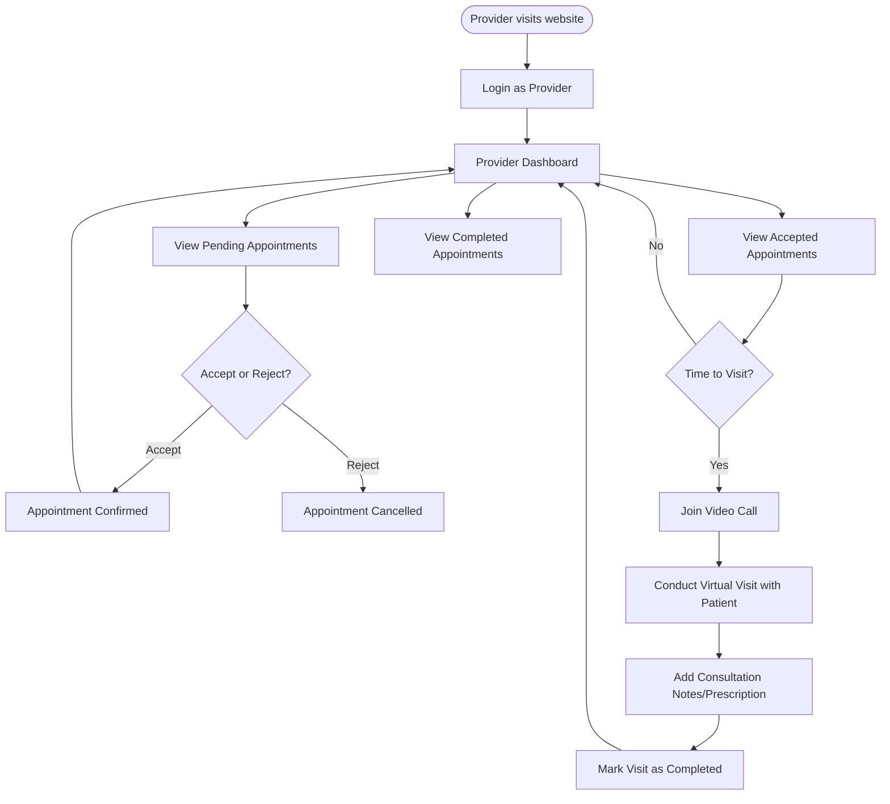
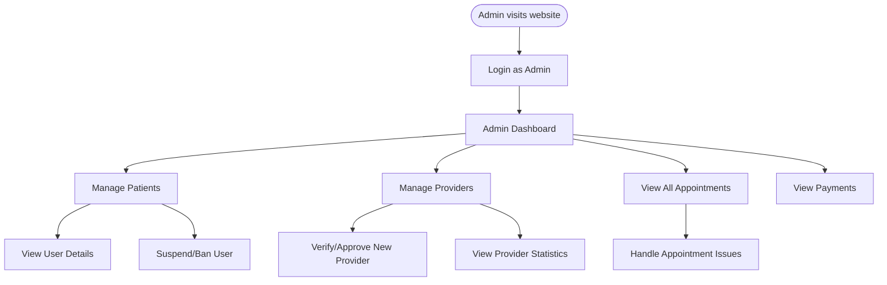

# User Flow Diagrams

Below are the primary user flows for the SkinSage application, depicted using Mermaid.js diagrams.

## 1. Patient User Flow

The Patient flow encompasses registration, logging in, booking appointments, conducting the visit (including AI analysis and video calls), and making payments.

```mermaid
flowchart TD
    Start([Patient visits website]) --> LoginCheck{Has Account?}
    LoginCheck -- No --> Register[Register Patient Account]
    Register --> Login
    LoginCheck -- Yes --> Login[Login as Patient]
    Login --> Dashboard[Patient Dashboard]

    Dashboard --> BrowseProviders[Browse Providers]
    Dashboard --> ViewAppointments[View Appointments]
    Dashboard --> AIAnalysis[Start AI Analysis]

    BrowseProviders --> SelectProvider[Select Provider]
    SelectProvider --> BookAppointment[Book Appointment]
    BookAppointment --> Payment[Process Payment]
    Payment -- Success --> AppointmentConfirmed[Appointment Confirmed]

    ViewAppointments --> JoinCall[Join Video Call (If 5 mins before)]
    JoinCall --> ConductVisit[Conduct Virtual Visit]
    ConductVisit --> VisitCompleted[Visit Completed]

    AIAnalysis --> UploadImage[Upload Image & Describe Symptoms]
    UploadImage --> ReceiveResults[Receive AI Diagnostics]
    ReceiveResults --> Dashboard
```

## 2. Provider User Flow

The Provider flow involves logging in, managing the schedule (accepting/rejecting appointments), conducting visits, and reviewing patient data.



## 3. Admin User Flow

The Admin flow is focused on system management, overseeing users, providers, and overall platform activity.


